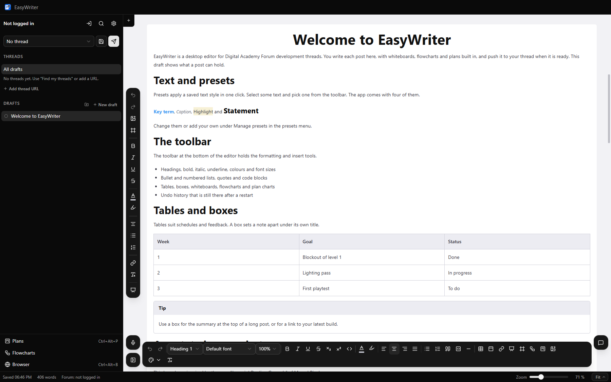
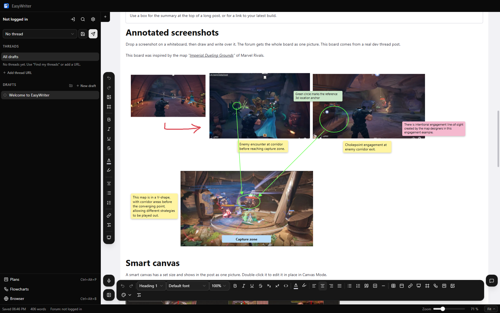
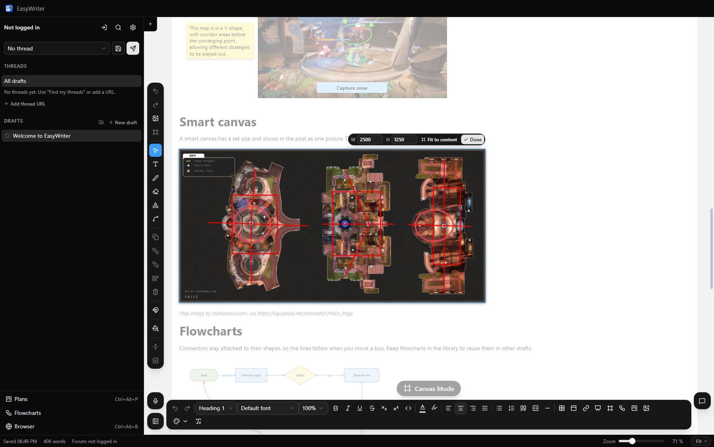
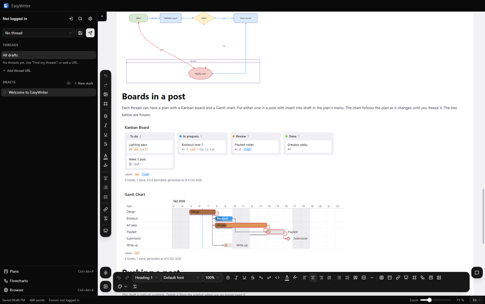
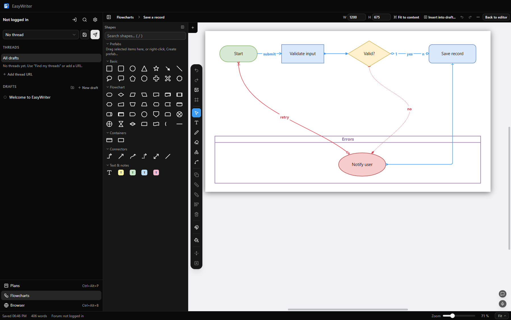
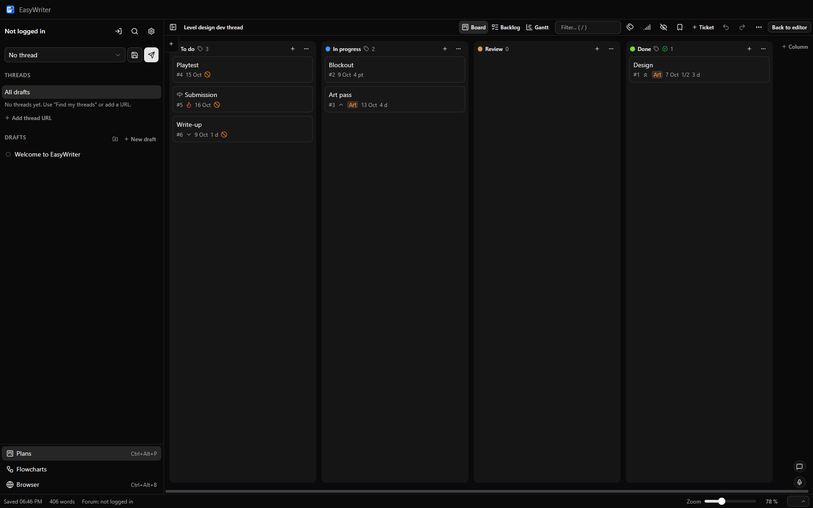
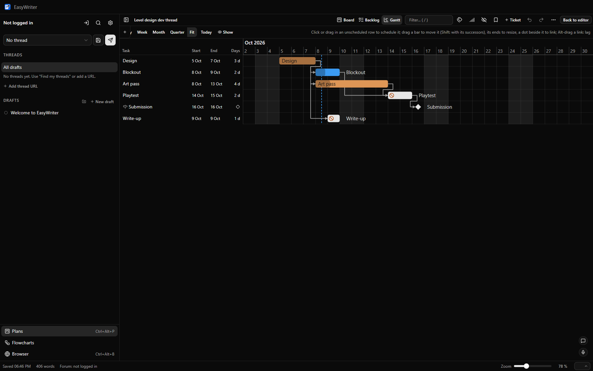

# EasyWriter

EasyWriter is a Windows desktop editor for writing Digital Academy Forum development-thread posts, with whiteboards, flowcharts and plans built in.



## What it does

- A rich text editor with headings, lists, quotes, code blocks, tables and boxes. Text presets apply a saved style in one click.
- Whiteboards inside a post for pictures, text and shapes. The forum gets each whiteboard as one picture.
- Annotate screenshots. Drop a screenshot on a whiteboard, then draw and write over it.
- Flowcharts whose connectors stay attached to their shapes. Keep them in the flowchart library to reuse them in other drafts.
- A plan for each thread, with a Kanban board, a backlog and a Gantt chart. A chart of the plan can go into a post.
- Push to the forum. EasyWriter opens your thread with the post in the reply box, and you press Submit yourself.
- A browser with tabs inside the app, so the forum and your references stay next to the draft.
- Dictation with Whisper, which runs on your own computer.
- A chat assistant that can read and edit your drafts. It uses your own key for Qwen Cloud, Google Gemini or DeepSeek.
- GitHub backup. Sign in with GitHub and EasyWriter keeps your drafts, plans and flowcharts in a private repository of your own.

On the first start EasyWriter opens a welcome draft that shows these features. Delete it from the sidebar when you no longer need it.

## Screenshots

Screenshots from a real dev thread post on a whiteboard, with drawings and notes over them.



A smart canvas open in Canvas Mode, where it is edited in place.



A plan's Kanban board and Gantt chart inside a post.



The flowchart library, where flowcharts are drawn and kept for reuse.



The Kanban board of a thread's plan.



The same plan as a Gantt chart, with the links between tasks.



## Download

Get EasyWriter from the [Releases page](https://github.com/DashingNights/EasyWriter/releases). There are two downloads.

- **EasyWriter-Setup-x.y.z.exe** is the installer, for a normal PC. Run it and follow the steps.
- **EasyWriter-x.y.z-win.zip** is the portable copy, for PCs that block installers. Extract it anywhere you can write to, such as the Desktop, and run EasyWriter.exe. Everything it saves, your posts included, lives in the `data` folder next to EasyWriter.exe, so keep that folder when you move the app.

EasyWriter is not code-signed, so Windows SmartScreen may warn you the first time you run it. Click **More info**, then **Run anyway**.

You can also download the portable copy without the warning. Make an empty folder, type `cmd` in the File Explorer address bar of that folder and press Enter, then run this line. It gets version 0.1.0, which updates itself to the newest version after it starts.

```
curl.exe -L -o EasyWriter.zip https://github.com/DashingNights/EasyWriter/releases/download/v0.1.0/EasyWriter-0.1.0-win.zip && tar -xf EasyWriter.zip
```

## Updates

The installed copy and the portable copy both update themselves from GitHub Releases. When a new version has downloaded, EasyWriter shows a Restart button. It saves your open draft before it restarts.

## Where your data lives

- Installed copy: `%APPDATA%\EasyWriter`
- Portable copy: the `data` folder next to EasyWriter.exe

## Build from source

You need Windows and Node.js 22 or newer.

```
npm install
npm start
```

`npm start` builds the app and opens it. `npm run dist` builds the installer and the portable zip into the `release` folder.

## Licence

The source is published so that you can read and review it. It is not open source, and you may not copy, change or redistribute it without written permission. You may download the official release builds and run them for your own use. See [LICENSE](LICENSE).
